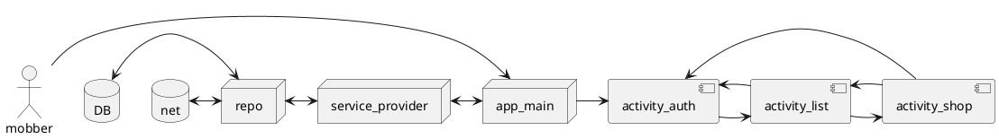

# ShopMob

Shopping list management for collaborative shopping trips

---

This document describes the [Use Cases](#use-cases), [Features](#features)
and [Architecture](#architecture) of the app to be developed.

See [README](../README.md) for an outline of the app.

---

## Synopsis

_**ShopMob**_ is an app for collaborative shopping with a group of people - the "shopping mob". 
The app allows "Shop Mobbers" (short: _Mobbers_) to act on a shared shopping list. If one Mobber 
ticks off an item of the list, all other Mobbers in the corresponding group (the _Shop Mob_) get
notified and see their lists updated accordingly.

_ShopMob_ thus facilitates group shopping and helps to reduce the time wasted in day-to-day shopping.

---

## Use Cases

ShopMob is designed to assist with the following use cases:

1. As a user of the app, I would like to join one or more shopping groups - the "Shop Mobs"
2. As a Shop Mop member - a Mobber - I would like to see who else is in my Shop Mob
3. As a Mobber, I would like to see what shopping lists have been defined for each of my Shop Mobs
4. As a Mobber, I would like to see what is on each of the shopping lists of each of my Shop Mobs
5. As a Mobber, I would like to add a shopping list to any of my Shop Mobs
6. As a Mobber, I would like to delete a shopping list I own (created by myself)
7. As a Mobber, I would like to add (remove) items to (from) any of the shopping lists of my Shop Mobs
8. As a Mobber, I would like to classify items on the list by product categories (e.g. "dairy", "appliances", ...)
9. As a Mobber, I would like to attribute list items to classes of shops (e.g. "supermarket", "hardware store", ...)
10. As a Mobber, I would like to attribute list items to specific shops from a list of known shops
11. As a Mobber, I would like to add shops to the list of known shops by clicking on their POI on the map
12. As a Mobber, I would like to remove shops from the list of know shops using the app
13. As a Mobber, I would like to receive a notification when a fellow Mobber has added (removed/ticked off) an item to (
    from) the list
14. As a Mobber, I would like to receive a notification when I am near a shop where an item of one of the lists I
    subscribed to can be purchased
15. As a Mobber, I would like to see a floor plan of the shop I am about to enter (/have entered)
16. As a Mobber, I would like to see a route through the shop, taking me to all items on my list which can be found in
    this shop
17. As a Mobber, I would like to see where in the shop zones for specific product categories are located (relating to
    the items on my shopping list)
18. As a Mobber, I would like to see an image of each 'zone of relevance', i.e. a zone in which any of my shopping list
    items can be found (rough localization)
19. As a Mobber, I would like to see an image of the section inside a zone where my shopping list item can be found (
    fine localization)
20. As a Mobber, I would like to get live updates when items on my list get modified by fellow Mobbers (
    added/removed/ticked off)

---

## Features

The app shall have a number of features:

1. Android UI/UX
   1. Authentication using the firebaseUI library
       1. Login / Sign-up using email & password
       2. Federated authentication using Google
   2. A UI with several screens (Android activities & fragments)
       1. Authentication screen (activity)
       2. Shopping list screen (activity)
           1. Fragment for administration of all Shop Mobs (subscribe, unsubscribe, sort by city)
           2. Fragment for administration of all shopping lists of an individual Shop Mob (create list, delete list)
           3. Fragments for administration of shops in my area
              1. Adding a shop shall be done by clicking on POIs on a map
              2. Removal of a shop from list of know shops
           4. Fragment for administration of an individual shopping list (add/remove items, categorize, attribute to shops)
           5. Fragment for the displaying of and interaction with a shopping list (viewing, sorting, filtering, ticking off
              items)
              1. A RecyclerView (RV) list shall be used to display shopping list items
              2. MotionLayout animations shall be used to support the user experience
                  1. Swiping left/right on a shopping list item shall mark it as 'ticked off' / 'active'
                  2. Swiping far left on a shopping list item shall delete the item
           6. Fragment with product details
              1. Access to camera to take picture of items
              2. Access to camera to take picture of shelf location
       3. Shop screen (activity)
          1. Fragment with zones of relevance and the fastest route through the shop
          2. Fragment with zone details (sections) and where the items can be found

2. Local and Network data
   1. Centralized data store on a firebase network storage
       1. This feature is essential to the sharing of the list with fellow Mobbers
       2. A WorkManager job shall be used to manage the synchronization with the firebase backend
   2. Repository: Data source abstraction - all online data shall be stored in a local database (DB) prior to being used in
      the app
       1. This allows the app to be used when inside a shop with poor/no network connectivity

3. Android System and HW Integration
   1. Interaction with Android and/or device HW
      1. Access to Google Maps as UI element for POI selection (shops)
      2. Access to the camera to take a picture of a product (enhance shopping list)
      3. Sending and receiving of notification
   2. Responding to and handling of HW and system events
      1. Life cycle events due to change of orientation and putting app into background 
      2. Permission handling
   

---

## Architecture

At _activity_ level, ShopMob has the following fundamental architecture:




---

## Specification

```kotlin
val dataSource: Repo
```
