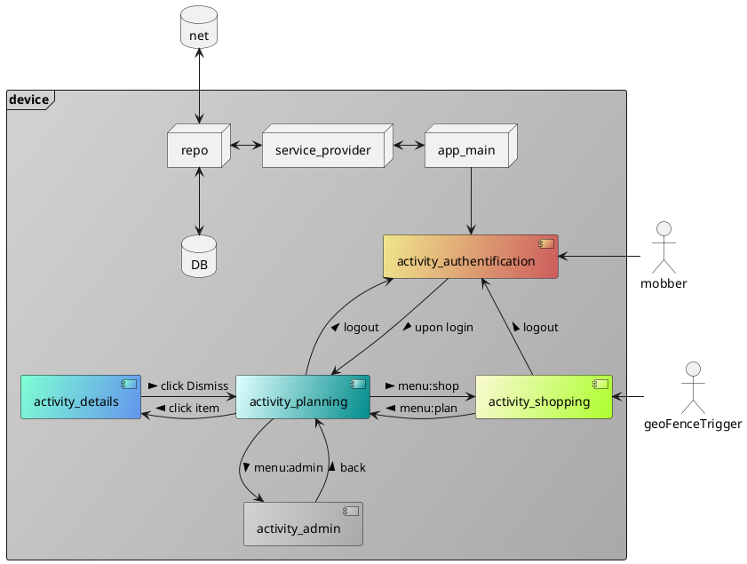

```plantuml
@startuml component

actor mobber
actor geoFenceTrigger
database net

frame "device" #lightgray/darkgray {

    node app_main
    node service_provider
    node repo
    database DB

    component activity_authentification #khaki/indianred
    component activity_planning #Lightcyan/Darkcyan
    component activity_details #aquamarine/cornflowerblue
    component activity_shopping #LightGoldenRodYellow/GreenYellow
    component activity_admin #Lightgrey/Darkgray

    DB <-up-> repo
    repo <-right-> service_provider
    service_provider <-right-> app_main
    app_main -down-> activity_authentification

    activity_details <-right- activity_planning : click item <
    activity_details -left-> activity_planning : click Dismiss >
    
    activity_authentification -down-> activity_planning : upon login >
    activity_authentification <-right- activity_planning : logout <
    
    activity_planning -> activity_shopping : menu:shop >
    activity_planning <- activity_shopping : menu:plan <
    
    activity_shopping -> activity_authentification : logout >
    
    activity_planning -down-> activity_admin : menu:admin >
    activity_admin -down-> activity_planning : back >
}

mobber -left-> activity_authentification
geoFenceTrigger -left-> activity_shopping
net <-down-> repo

@enduml
```