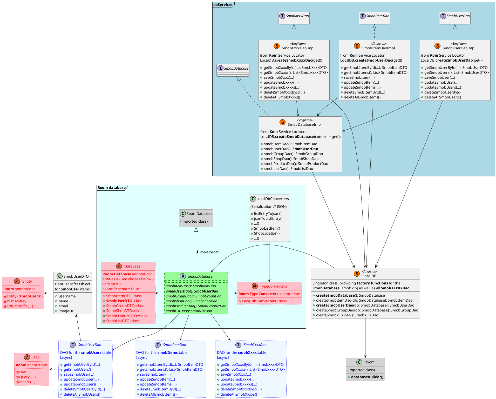

```plantuml
@startuml

frame "Room database" #Lightcyan {

    class RoomDatabase #lightgray ##gray {
        {field} (imported class)
    } 
    
    abstract SmobDatabase #palegreen ##[dashed]green {
      {abstract} smobItemDao(): SmobItemDao
      {abstract} **smobUserDao(): SmobUserDao**
      {abstract} smobGroupDao(): SmobGroupDao
      {abstract} smobShopDao(): SmobShopDao
      {abstract} smobProductDao(): SmobProductDao
      {abstract} smobListDao(): SmobListDao
    }
    
    SmobDatabase -up-|> RoomDatabase : implements >
    
    annotation Database #pink;line:red;line.dotted;text:red {
        **Room Database** annotation:
        entities = { see classes below }
        version = 1
        exportSchema = false
        ---
      +SmobItemDTO::class
      +**SmobUserDTO**::class
      +SmobGroupDTO::class
      +SmobShopDTO::class
      +SmobProductDTO::class
      +SmobListDTO::class
    }
    
    annotation TypeConverters #pink;line:red;line.dotted;text:red {
        **Room TypeConverters ** annotation:
        ---
      +**LocalDbConverters**::class
    }
    
    together {
        SmobDatabase -left-> Database
        SmobDatabase -right-> TypeConverters
    }
    
    class LocalDbConverters {
        {field} (Serialization // JSON)
        + listEntryToJson()
        + jsonToListEntry()
        + ...()
        + SmobListItem()
        + ShopLocation()
        + ...()
    }
     
    LocalDbConverters -down-> TypeConverters
 
}

interface SmobItemDao #aliceblue;line:blue;line.dotted;text:blue {
    DAO for the **smobItems** table
    [async]
    +getSmobItemById(...): SmobItemDTO
    +getSmobItems(): List<SmobItemDTO>
    +saveSmobItem(...)
    +updateSmobItem(...)
    +updateSmobItems(...)
    +deleteSmobItemById(...)
    +deleteAllSmobItems()
}

interface SmobUserDao #aliceblue;line:blue;line.dotted;text:blue {
    DAO for the **smobUsers** table
    [async]
    +getSmobUserById(...)
    +getSmobUsers()
    +saveSmobUser(...)
    +updateSmobUser(...)
    +updateSmobUsers(...)
    +deleteSmobUserById(...)
    +deleteAllSmobUsers()
}

interface SmobXxxxDao #aliceblue;line:blue;line.dotted;text:blue {
    DAO for the **smobXxxx** table
    [async]
    +getSmobXxxxById(...): SmobXxxxDTO
    +getSmobXxxxs(): List<SmobXxxxDTO>
    +saveSmobXxxx(...)
    +updateSmobXxxx(...)
    +updateSmobXxxxs(...)
    +deleteSmobXxxxById(...)
    +deleteAllSmobXxxxs()
}

together {
    SmobDatabase -down-> SmobItemDao
    SmobDatabase -down-> SmobUserDao
    SmobDatabase -down-> SmobXxxxDao
}


class LocalDB << (S,#FF7700) Singleton >> {
  Singleton class, providing **factory functions** for the
  **SmobDatabase** [smob.db] as well as all **Smob<XXX>Dao**

  +**createSmobDatabase**(): SmobDatabase
  +createSmobItemDao(db: SmobDatabase): SmobItemDao
  +**createSmobUserDao**(db: SmobDatabase): SmobUserDao
  +createSmobGroupDao(db: SmobDatabase): SmobGroupDao
  +createSmob<...>Dao(): Smob<...>Dao
}

class Room #lightgray ##gray {
 {field} (imported class)
 + **databaseBuilder**()
 }

LocalDB -left-> SmobDatabase
LocalDB -down-> Room


class SmobUserDTO {
    Data Transfer Object
    for **SmobUser** items
    ---
    +username
    +name
    +email
    +imageUrl
}
    
SmobUserDao -up-> SmobUserDTO

annotation Entity #pink;line:red;line.dotted;text:red {
   **Room** annotations
   {method} @Entity ("**smobUsers**")
   {method} @PrimaryKey
   {method} @ColumnInfo (...)
}

SmobUserDTO -left-> Entity

annotation Dao #pink;line:red;line.dotted;text:red {
   **Room** annotations
   {method} @Dao
   {method} @Query (...)
   {method} @Insert (...)
}

SmobUserDao -left-> Dao

frame "dbServices" #Lightblue {

    class SmobDatabaseImpl << (S,#FF7700) Singleton >> implements SmobDatabase {
        from **Koin** Service Locator:
        LocalDB.**createSmobDatabase**(context = get())
        ---
        +smobItemDao(): SmobItemDao
        +smobUserDao(): **SmobUserDao**
        +smobGroupDao(): SmobGroupDao
        +smobShopDao(): SmobShopDao
        +smobProductDao(): SmobProductDao
        +smobListDao(): SmobListDao
    }
    
    class SmobUserDaoImpl << (S,#FF7700) Singleton >> implements SmobUserDao {
        from **Koin** Service Locator
        LocalDB.**createSmobUserDao**(get())
        ---
        +getSmobUserById(...): SmobUserDTO
        +getSmobUsers(): List<SmobUserDTO>
        +saveSmobUser(...)
        +updateSmobUser(...)
        +updateSmobUsers(...)
        +deleteSmobUserById(...)
        +deleteAllSmobUsers()
    }
    
    class SmobItemDaoImpl << (S,#FF7700) Singleton >> implements SmobItemDao {
        from **Koin** Service Locator
        LocalDB.**createSmobUserDao**(get())
        ---
        +getSmobItemById(...): SmobItemDTO
        +getSmobItems(): List<SmobItemDTO>
        +saveSmobItem(...)
        +updateSmobItem(...)
        +updateSmobItems(...)
        +deleteSmobItemById(...)
        +deleteAllSmobItems()
    }
    
    class SmobXxxxDaoImpl << (S,#FF7700) Singleton >> implements SmobXxxxDao {
        from **Koin** Service Locator
        LocalDB.**createSmobXxxxDao**(get())
        ---
        +getSmobXxxxById(...): SmobXxxxDTO
        +getSmobXxxxs(): List<SmobXxxxDTO>
        +saveSmobXxxx(...)
        +updateSmobXxxx(...)
        +updateSmobXxxxs(...)
        +deleteSmobXxxxById(...)
        +deleteAllSmobXxxxs()
    }
    
    SmobDatabaseImpl <-up- SmobUserDaoImpl 
    SmobDatabaseImpl <-up- SmobItemDaoImpl 
    SmobDatabaseImpl <-up- SmobXxxxDaoImpl 
    
}

together {
    LocalDB <-up-- SmobDatabaseImpl
    LocalDB <-up-- SmobUserDaoImpl
    LocalDB <-up-- SmobItemDaoImpl
    LocalDB <-up-- SmobXxxxDaoImpl
}

@enduml
```
