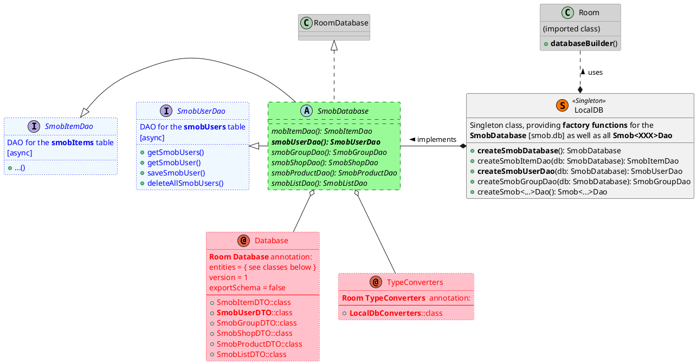

```plantuml
@startuml
annotation Database #pink;line:red;line.dotted;text:red {
    **Room Database** annotation:
    entities = { see classes below }
    version = 1
    exportSchema = false
    ---
  +SmobItemDTO::class
  +**SmobUserDTO**::class
  +SmobGroupDTO::class
  +SmobShopDTO::class
  +SmobProductDTO::class
  +SmobListDTO::class
}

annotation TypeConverters #pink;line:red;line.dotted;text:red {
    **Room TypeConverters ** annotation:
    ---
  +**LocalDbConverters**::class
}

interface SmobUserDao #aliceblue;line:blue;line.dotted;text:blue {
  DAO for the **smobUsers** table
  [async]
  +getSmobUsers()
  +getSmobUser()
  +saveSmobUser()
  +deleteAllSmobUsers()
}

interface SmobItemDao #aliceblue;line:blue;line.dotted;text:blue {
  DAO for the **smobItems** table
  [async]
  +...()
}

abstract SmobDatabase #palegreen ##[dashed]green implements RoomDatabase {
  {abstract} mobItemDao(): SmobItemDao
  {abstract} **smobUserDao(): SmobUserDao**
  {abstract} smobGroupDao(): SmobGroupDao
  {abstract} smobShopDao(): SmobShopDao
  {abstract} smobProductDao(): SmobProductDao
  {abstract} smobListDao(): SmobListDao
}

class RoomDatabase #lightgray ##gray

class LocalDB << (S,#FF7700) Singleton >> {
  Singleton class, providing **factory functions** for the
  **SmobDatabase** [smob.db] as well as all **Smob<XXX>Dao**

  +**createSmobDatabase**(): SmobDatabase
  +createSmobItemDao(db: SmobDatabase): SmobItemDao
  +**createSmobUserDao**(db: SmobDatabase): SmobUserDao
  +createSmobGroupDao(db: SmobDatabase): SmobGroupDao
  +createSmob<...>Dao(): Smob<...>Dao
}

class Room #lightgray ##gray {
 {field} (imported class)
 + **databaseBuilder**()
 }

LocalDB *-left- SmobDatabase : implements >
LocalDB *.up. Room : uses >

together {
SmobDatabase o-down- Database
SmobDatabase o-down- TypeConverters
}

together {
    SmobDatabase -left-|> SmobUserDao
    SmobDatabase -left-|> SmobItemDao
}
@enduml
```
est
