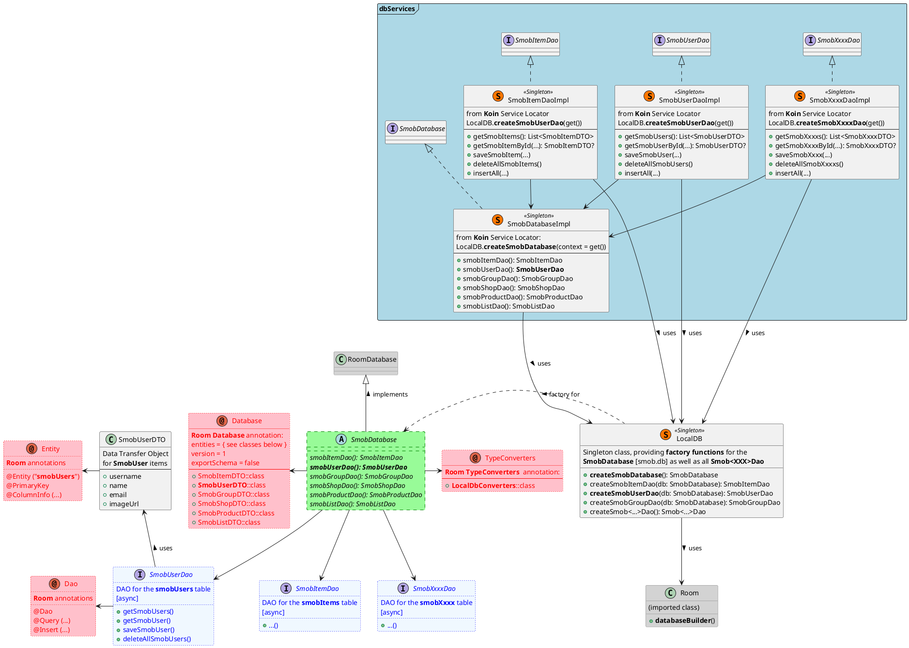

```plantuml
@startuml

class RoomDatabase #lightgray ##gray

abstract SmobDatabase #palegreen ##[dashed]green {
  {abstract} smobItemDao(): SmobItemDao
  {abstract} **smobUserDao(): SmobUserDao**
  {abstract} smobGroupDao(): SmobGroupDao
  {abstract} smobShopDao(): SmobShopDao
  {abstract} smobProductDao(): SmobProductDao
  {abstract} smobListDao(): SmobListDao
}

SmobDatabase -up-|> RoomDatabase : implements >

annotation Database #pink;line:red;line.dotted;text:red {
    **Room Database** annotation:
    entities = { see classes below }
    version = 1
    exportSchema = false
    ---
  +SmobItemDTO::class
  +**SmobUserDTO**::class
  +SmobGroupDTO::class
  +SmobShopDTO::class
  +SmobProductDTO::class
  +SmobListDTO::class
}

annotation TypeConverters #pink;line:red;line.dotted;text:red {
    **Room TypeConverters ** annotation:
    ---
  +**LocalDbConverters**::class
}

together {
    SmobDatabase -left-> Database
    SmobDatabase -right-> TypeConverters
}

interface SmobItemDao #aliceblue;line:blue;line.dotted;text:blue {
  DAO for the **smobItems** table
  [async]
  +...()
}

interface SmobUserDao #aliceblue;line:blue;line.dotted;text:blue {
  DAO for the **smobUsers** table
  [async]
  +getSmobUsers()
  +getSmobUser()
  +saveSmobUser()
  +deleteAllSmobUsers()
}

interface SmobXxxxDao #aliceblue;line:blue;line.dotted;text:blue {
  DAO for the **smobXxxx** table
  [async]
  +...()
}

together {
    SmobDatabase -down-> SmobItemDao
    SmobDatabase -down-> SmobUserDao
    SmobDatabase -down-> SmobXxxxDao
}


class LocalDB << (S,#FF7700) Singleton >> {
  Singleton class, providing **factory functions** for the
  **SmobDatabase** [smob.db] as well as all **Smob<XXX>Dao**

  +**createSmobDatabase**(): SmobDatabase
  +createSmobItemDao(db: SmobDatabase): SmobItemDao
  +**createSmobUserDao**(db: SmobDatabase): SmobUserDao
  +createSmobGroupDao(db: SmobDatabase): SmobGroupDao
  +createSmob<...>Dao(): Smob<...>Dao
}

class Room #lightgray ##gray {
 {field} (imported class)
 + **databaseBuilder**()
 }

LocalDB .left.> SmobDatabase : factory for >
LocalDB -down-> Room : uses >


class SmobUserDTO {
    Data Transfer Object
    for **SmobUser** items
    ---
    +username
    +name
    +email
    +imageUrl
}
    
SmobUserDao -up-> SmobUserDTO : uses >

annotation Entity #pink;line:red;line.dotted;text:red {
   **Room** annotations
   {method} @Entity ("**smobUsers**")
   {method} @PrimaryKey
   {method} @ColumnInfo (...)
}

SmobUserDTO -left-> Entity

annotation Dao #pink;line:red;line.dotted;text:red {
   **Room** annotations
   {method} @Dao
   {method} @Query (...)
   {method} @Insert (...)
}

SmobUserDao -left-> Dao

frame "dbServices" #Lightblue {

    class SmobDatabaseImpl << (S,#FF7700) Singleton >> implements SmobDatabase {
        from **Koin** Service Locator:
        LocalDB.**createSmobDatabase**(context = get())
        ---
        +smobItemDao(): SmobItemDao
        +smobUserDao(): **SmobUserDao**
        +smobGroupDao(): SmobGroupDao
        +smobShopDao(): SmobShopDao
        +smobProductDao(): SmobProductDao
        +smobListDao(): SmobListDao
    }
    
    class SmobUserDaoImpl << (S,#FF7700) Singleton >> implements SmobUserDao {
        from **Koin** Service Locator
        LocalDB.**createSmobUserDao**(get())
        ---
        +getSmobUsers(): List<SmobUserDTO>
        +getSmobUserById(...): SmobUserDTO?
        +saveSmobUser(...)
        +deleteAllSmobUsers()
        +insertAll(...)
    }
    
    class SmobItemDaoImpl << (S,#FF7700) Singleton >> implements SmobItemDao {
        from **Koin** Service Locator
        LocalDB.**createSmobUserDao**(get())
        ---
        +getSmobItems(): List<SmobItemDTO>
        +getSmobItemById(...): SmobItemDTO?
        +saveSmobItem(...)
        +deleteAllSmobItems()
        +insertAll(...)    
    }
    
    class SmobXxxxDaoImpl << (S,#FF7700) Singleton >> implements SmobXxxxDao {
        from **Koin** Service Locator
        LocalDB.**createSmobXxxxDao**(get())
        ---
        +getSmobXxxxs(): List<SmobXxxxDTO>
        +getSmobXxxxById(...): SmobXxxxDTO?
        +saveSmobXxxx(...)
        +deleteAllSmobXxxxs()
        +insertAll(...)  
    }
    
    SmobDatabaseImpl <-up- SmobUserDaoImpl 
    SmobDatabaseImpl <-up- SmobItemDaoImpl 
    SmobDatabaseImpl <-up- SmobXxxxDaoImpl 
    
}

together {
    LocalDB <-up-- SmobDatabaseImpl : uses <
    LocalDB <-up-- SmobUserDaoImpl : uses <
    LocalDB <-up-- SmobItemDaoImpl : uses <
    LocalDB <-up-- SmobXxxxDaoImpl : uses <
}

@enduml
```
