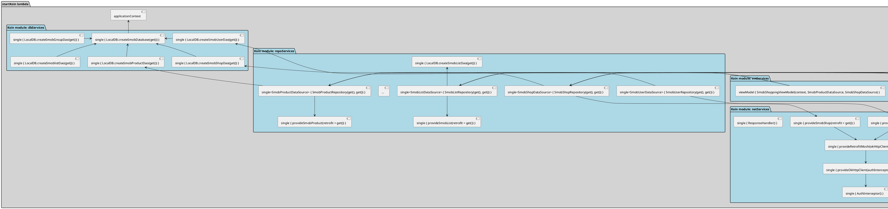

```plantuml
@startuml
package "startKoin lambda" #Lightgray {

    package "Koin module: dbServices" #Lightblue {
        [single { LocalDB.createSmobProductDao(get()) }]   -up->      [single { LocalDB.createSmobDatabase(get()) }]
        [single { LocalDB.createSmobShopDao(get()) }]      -up->    [single { LocalDB.createSmobDatabase(get()) }]
        [single { LocalDB.createSmobUserDao(get()) }]          -left->   [single { LocalDB.createSmobDatabase(get()) }]
        [single { LocalDB.createSmobGroupDao(get()) }]     -right->   [single { LocalDB.createSmobDatabase(get()) }]
        [single { LocalDB.createSmoblistDao(get()) }]  -up->      [single { LocalDB.createSmobDatabase(get()) }]
    }

    [applicationContext]<-down-[single { LocalDB.createSmobDatabase(get()) }]

    package "Koin module: netServices" #Lightblue {
        together {
            [single { AuthInterceptor() }]
            [single { provideOkHttpClient(authInterceptor = get()) }]  -down->  [single { AuthInterceptor() }]
            [single { provideRetrofitMoshi(okHttpClient = get()) }]    -down->  [single { provideOkHttpClient(authInterceptor = get()) }]
            [single { provideSmobUserApi(retrofit = get()) }]      -down->  [single { provideRetrofitMoshi(okHttpClient = get()) }]
            [single { provideSmobShop(retrofit = get()) }]            -down->  [single { provideRetrofitMoshi(okHttpClient = get()) }]
        }
        [single { ResponseHandler() }]
    }

    package "Koin module: repoServices" #Lightblue {
        together {
            [...]
            [single<SmobUserDataSource> { SmobUserRepository(get(), get()) }]        -up->    [single { LocalDB.createSmobUserDao(get()) }]
            [single<SmobUserDataSource> { SmobUserRepository(get(), get()) }]        -down->  [single { provideSmobUserApi(retrofit = get()) }]
            [single<SmobShopDataSource> { SmobShopRepository(get(), get()) }]        -up->    [single { LocalDB.createSmobShopDao(get()) }]
            [single<SmobShopDataSource> { SmobShopRepository(get(), get()) }]        -down->  [single { provideSmobShop(retrofit = get()) }]
            [single<SmobProductDataSource> { SmobProductRepository(get(), get()) }]  -up->    [single { LocalDB.createSmobProductDao(get()) }]
            [single<SmobProductDataSource> { SmobProductRepository(get(), get()) }]  -down->  [single { provideSmobProduct(retrofit = get()) }]
            [single<SmobListDataSource> { SmobListRepository(get(), get()) }]        -up->    [single { LocalDB.createSmobListDao(get()) }]
            [single<SmobListDataSource> { SmobListRepository(get(), get()) }]        -down->  [single { provideSmobList(retrofit = get()) }]
        }
    }

   package "Koin module: vmServices" #Lightblue {
        together {
            [viewModel { PlanningListsViewModel(context, SmobListDataSource) }]                        -right->  [single<SmobListDataSource> { SmobListRepository(get(), get()) }]
            [viewModel { PlanningListsEditViewModel(context, SmobListDataSource) }]                    -right->  [single<SmobListDataSource> { SmobListRepository(get(), get()) }]
            [viewModel { PlanningProductListViewModel(context, SmobListDataSource, SmobProductDataSource, SmobShopDataSource) }]  -right->    [single<SmobShopDataSource> { SmobShopRepository(get(), get()) }]
            [viewModel { PlanningProductListViewModel(context, SmobListDataSource, SmobProductDataSource, SmobShopDataSource) }]  -right->    [single<SmobProductDataSource> { SmobProductRepository(get(), get()) }]
            [viewModel { PlanningProductListViewModel(context, SmobListDataSource, SmobProductDataSource, SmobShopDataSource) }]  -right->    [single<SmobListDataSource> { SmobListRepository(get(), get()) }]
            [viewModel { PlanningShopListViewModel(context, SmobShopDataSource) }]                     -right->  [single<SmobShopDataSource> { SmobShopRepository(get(), get()) }]
            [viewModel { AdminViewModel(context, SmobListDataSource) }]                                -right->  [single<SmobListDataSource> { SmobListRepository(get(), get()) }]
            [viewModel { DetailsViewModel(context, SmobProductDataSource, SmobShopDataSource) }]       -right->  [single<SmobShopDataSource> { SmobShopRepository(get(), get()) }]
            [viewModel { DetailsViewModel(context, SmobProductDataSource, SmobShopDataSource) }]       -right->  [single<SmobProductDataSource> { SmobProductRepository(get(), get()) }]
            [viewModel { SmobShoppingViewModel(context, SmobProductDataSource, SmobShopDataSource) }]  -right->  [single<SmobShopDataSource> { SmobShopRepository(get(), get()) }]
            [viewModel { SmobShoppingViewModel(context, SmobProductDataSource, SmobShopDataSource) }]  -right->  [single<SmobProductDataSource> { SmobProductRepository(get(), get()) }]
        }
    }
@enduml
```