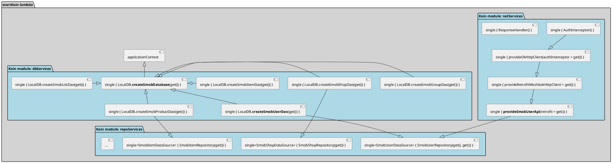

```plantuml
@startuml
package "startKoin lambda" #Lightgray {

    package "Koin module: dbServices" #Lightblue {
        [single { LocalDB.createSmobItemDao(get()) }]          -left-|>    [single { LocalDB.**createSmobDatabase**(get()) }]
        together {
            [single { LocalDB.createSmobProductDao(get()) }]    -up-|>     [single { LocalDB.**createSmobDatabase**(get()) }]
            [single { LocalDB.createSmobShopDao(get()) }]       -left-|>   [single { LocalDB.**createSmobDatabase**(get()) }]
        }
        [single { LocalDB.createSmobListDao(get()) }]          -right-|>  [single { LocalDB.**createSmobDatabase**(get()) }]
        together {
            [single { LocalDB.**createSmobUserDao**(get()) }]  -up-|>      [single { LocalDB.**createSmobDatabase**(get()) }]
            [single { LocalDB.createSmobGroupDao(get()) }]     -right-|>   [single { LocalDB.**createSmobDatabase**(get()) }]
        }
    }

    [applicationContext]<|-down-[single { LocalDB.**createSmobDatabase**(get()) }]

    package "Koin module: netServices" #Lightblue {
        together {
            [single { AuthInterceptor() }]
            [single { provideOkHttpClient(authInterceptor = get()) }] <|-up- [single { AuthInterceptor() }]
            [single { provideRetrofitMoshi(okHttpClient = get()) }] <|-up- [single { provideOkHttpClient(authInterceptor = get()) }]
            [single { **provideSmobUserApi**(retrofit = get()) }] <|-up- [single { provideRetrofitMoshi(okHttpClient = get()) }]
        }
        [single { ResponseHandler() }]
    }

    package "Koin module: repoServices" #Lightblue {
        together {
            [single<SmobUserDataSource> { SmobUserRepository(get(), get()) }] <|-up- [single { LocalDB.**createSmobUserDao**(get()) }]
            [single<SmobUserDataSource> { SmobUserRepository(get(), get()) }] <|-up- [single { **provideSmobUserApi**(retrofit = get()) }]
            [single<SmobItemDataSource> { SmobItemRepository(get()) }]        <|-up- [single { LocalDB.createSmobProductDao(get()) }]
            [single<SmobShopDataSource> { SmobShopRepository(get()) }]        <|-up- [single { LocalDB.createSmobShopDao(get()) }]
            [...]
        }
    }
@enduml
```