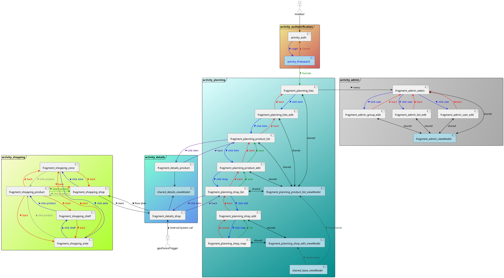

```plantuml
@startuml component

actor mobber
actor geoFenceTrigger

frame "activity_shopping" #LightGoldenRodYellow/GreenYellow {
    
    component fragment_shopping_shop
    component fragment_shopping_zone
    component fragment_shopping_aisle
    component fragment_shopping_shelf
    component fragment_shopping_product

    fragment_shopping_shop -down-> fragment_shopping_zone #blue;text:blue : click zone > 
    fragment_shopping_zone -down-> fragment_shopping_aisle #blue;text:blue : click aisle > 
    fragment_shopping_aisle -down-> fragment_shopping_shelf #blue;text:blue : click shelf >
    fragment_shopping_shelf -down-> fragment_shopping_product #blue;text:blue : click product >

    fragment_shopping_zone -> fragment_shopping_shop #red;text:red : back >
    fragment_shopping_aisle -> fragment_shopping_zone #red;text:red : back >
    fragment_shopping_shelf -> fragment_shopping_aisle #red;text:red : back >
    fragment_shopping_product -> fragment_shopping_shelf #red;text:red : back >

    fragment_shopping_shop -> fragment_shopping_product #gray;text:gray : click product > 
    fragment_shopping_product -> fragment_shopping_shop #red;text:red : back >

    fragment_shopping_zone -> fragment_shopping_product #gray;text:gray : click product > 
    fragment_shopping_product -> fragment_shopping_zone #red;text:red : back >
    
    fragment_shopping_aisle -> fragment_shopping_product #gray;text:gray : click product >
    fragment_shopping_product -> fragment_shopping_aisle #red;text:red : back >
    fragment_shopping_product -> fragment_shopping_shop #green;text:green : select product >

}

frame "activity_planning" #Lightcyan/Darkcyan {
    
    component fragment_planning_lists
    component fragment_planning_lists_edit
    component fragment_planning_product_list
    component fragment_planning_product_edit
    component fragment_planning_shop_list
    component fragment_planning_shop_edit
    component fragment_planning_shop_map
    
    component fragment_planning_product_list_viewModel #lightblue
    component fragment_planning_shop_edit_viewModel #lightblue

    component shared_base_viewModel #lightblue

    
    fragment_planning_lists_edit -down-> fragment_planning_lists #red;text:red : back > 
    fragment_planning_lists -down-> fragment_planning_lists_edit #blue;text:blue : click item > 

    fragment_planning_lists_edit -down-> fragment_planning_product_list #blue;text:blue : click item >
    fragment_planning_product_list -down-> fragment_planning_lists_edit #red;text:red : back >

    fragment_planning_product_list -down-> fragment_planning_product_edit #blue;text:blue : click item >
    fragment_planning_product_edit -down-> fragment_planning_product_list #red;text:red : back > 
    fragment_planning_product_edit -down-> fragment_planning_product_list #green;text:green : save >

    fragment_planning_product_edit -down-> fragment_planning_shop_list #blue;text:blue : click shop > 
    fragment_planning_shop_list -down-> fragment_planning_product_edit #red;text:red : back > 
    fragment_planning_shop_list -down-> fragment_planning_product_edit #green;text:green : save > 

    fragment_planning_shop_list -down-> fragment_planning_shop_edit #blue;text:blue : click add > 
    fragment_planning_shop_edit -down-> fragment_planning_shop_list #red;text:red : back > 

    fragment_planning_shop_edit -down-> fragment_planning_shop_map #blue;text:blue : click map >
    fragment_planning_shop_map -down-> fragment_planning_shop_edit #green;text:green : Ok >
    fragment_planning_shop_map -down-> fragment_planning_shop_edit #red;text:red : Cancel > 

    fragment_planning_product_list_viewModel <-left-> fragment_planning_lists #black : shared
    fragment_planning_product_list_viewModel <-left-> fragment_planning_lists_edit #black : shared
    fragment_planning_product_list_viewModel <-left-> fragment_planning_product_list #black : shared
    fragment_planning_product_list_viewModel <-left-> fragment_planning_product_edit #black : shared
    fragment_planning_product_list_viewModel <-left-> fragment_planning_shop_list #black : shared
    fragment_planning_shop_edit_viewModel <-left-> fragment_planning_shop_edit #black : shared
    fragment_planning_shop_edit_viewModel <-left-> fragment_planning_shop_map #black : shared

    fragment_planning_product_list_viewModel *-down- shared_base_viewModel #DarkSlateGray;text:DarkSlateGray : implements >
    fragment_planning_shop_edit_viewModel *-down- shared_base_viewModel #DarkSlateGray;text:DarkSlateGray : implements >

}

frame "activity_details" #aquamarine/cornflowerblue {
    
    component fragment_details_product
    component fragment_details_shop
    
    component shared_details_viewModel #lightblue

    geoFenceTrigger -up-> fragment_details_shop : Android System call >


    fragment_planning_product_list -down-> fragment_details_product #indigo;text:indigo : click item > 
    fragment_details_product -up-> fragment_planning_product_list #indigo;text:indigo : back >

    fragment_planning_shop_list -> fragment_details_shop #indigo;text:indigo : click item >
    fragment_details_shop -> fragment_planning_shop_list #indigo;text:indigo : back >

    fragment_details_product --[hidden]- fragment_details_shop

    fragment_details_shop -down-> fragment_shopping_shop : floor plan >
    fragment_shopping_shop -down-> fragment_details_shop : back >
    
    fragment_details_product -down-> shared_details_viewModel
    fragment_details_shop -up-> shared_details_viewModel
    

}


frame "activity_admin" #Lightgrey/Darkgray {
    
    component fragment_admin_select
    component fragment_admin_user_edit
    component fragment_admin_group_edit
    component fragment_admin_list_edit
    
    component fragment_admin_viewModel #lightblue


    fragment_planning_lists -right-> fragment_admin_select : menu >
    
    fragment_admin_select -down-> fragment_admin_user_edit #blue;text:blue : click user >
    fragment_admin_user_edit -> fragment_admin_select #red;text:red : back >

    fragment_admin_select -down-> fragment_admin_group_edit #blue;text:blue : click user >
    fragment_admin_group_edit -> fragment_admin_select #red;text:red : back >
    
    fragment_admin_select -down-> fragment_admin_list_edit #blue;text:blue : click user >
    fragment_admin_list_edit -> fragment_admin_select #red;text:red : back >
    
    fragment_admin_select <-right-> fragment_admin_viewModel #black : shared
    fragment_admin_user_edit <-down-> fragment_admin_viewModel #black : shared
    fragment_admin_group_edit <-down-> fragment_admin_viewModel #black : shared
    fragment_admin_list_edit <-down-> fragment_admin_viewModel #black : shared

}


frame "activity_authentification" #khaki/indianred {
    
    component activity_auth
    component activity_firebaseUI #lightblue;text:blue;line:blue

    mobber -down-> activity_auth
    
    activity_auth -down-> activity_firebaseUI #blue;text:blue : Login >
    activity_firebaseUI -down-> activity_auth #brown;text:brown : Cancel >
    activity_firebaseUI -down-> fragment_planning_lists #green;text:green : Success >

}


@enduml
```
