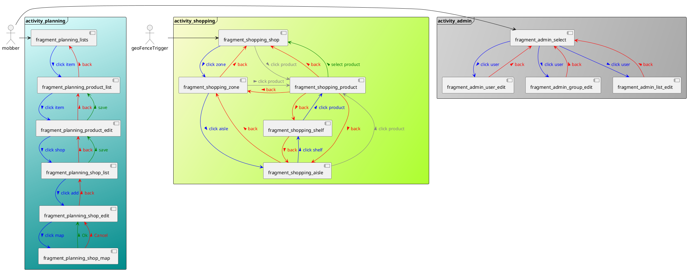

```plantuml
@startuml component

actor mobber
actor geoFenceTrigger

frame "activity_planning" #Lightcyan/Darkcyan {
    
    component fragment_planning_lists
    component fragment_planning_product_list
    component fragment_planning_product_edit
    component fragment_planning_shop_list
    component fragment_planning_shop_edit
    component fragment_planning_shop_map

    mobber -> fragment_planning_lists
    
    fragment_planning_lists -down-> fragment_planning_product_list #blue;text:blue : click item > 
    fragment_planning_product_list -down-> fragment_planning_lists #red;text:red : back > 

    fragment_planning_product_list -down-> fragment_planning_product_edit #blue;text:blue : click item >
    fragment_planning_product_edit -down-> fragment_planning_product_list #red;text:red : back > 
    fragment_planning_product_edit -down-> fragment_planning_product_list #green;text:green : save >

    fragment_planning_product_edit -down-> fragment_planning_shop_list #blue;text:blue : click shop > 
    fragment_planning_shop_list -down-> fragment_planning_product_edit #red;text:red : back > 
    fragment_planning_shop_list -down-> fragment_planning_product_edit #green;text:green : save > 

    fragment_planning_shop_list -down-> fragment_planning_shop_edit #blue;text:blue : click add > 
    fragment_planning_shop_edit -down-> fragment_planning_shop_list #red;text:red : back > 

    fragment_planning_shop_edit -down-> fragment_planning_shop_map #blue;text:blue : click map >
    fragment_planning_shop_map -down-> fragment_planning_shop_edit #green;text:green : Ok >
    fragment_planning_shop_map -down-> fragment_planning_shop_edit #red;text:red : Cancel > 

}

frame "activity_shopping" #LightGoldenRodYellow/GreenYellow {
    
    component fragment_shopping_shop
    component fragment_shopping_zone
    component fragment_shopping_aisle
    component fragment_shopping_shelf
    component fragment_shopping_product

    geoFenceTrigger -> fragment_shopping_shop

    fragment_shopping_shop -down-> fragment_shopping_zone #blue;text:blue : click zone > 
    fragment_shopping_zone -down-> fragment_shopping_aisle #blue;text:blue : click aisle > 
    fragment_shopping_aisle -down-> fragment_shopping_shelf #blue;text:blue : click shelf >
    fragment_shopping_shelf -down-> fragment_shopping_product #blue;text:blue : click product >

    fragment_shopping_zone -> fragment_shopping_shop #red;text:red : back >
    fragment_shopping_aisle -> fragment_shopping_zone #red;text:red : back >
    fragment_shopping_shelf -> fragment_shopping_aisle #red;text:red : back >
    fragment_shopping_product -> fragment_shopping_shelf #red;text:red : back >

    fragment_shopping_shop -> fragment_shopping_product #gray;text:gray : click product > 
    fragment_shopping_product -> fragment_shopping_shop #red;text:red : back >

    fragment_shopping_zone -> fragment_shopping_product #gray;text:gray : click product > 
    fragment_shopping_product -> fragment_shopping_zone #red;text:red : back >
    
    fragment_shopping_aisle -> fragment_shopping_product #gray;text:gray : click product >
    fragment_shopping_product -> fragment_shopping_aisle #red;text:red : back >
    fragment_shopping_product -> fragment_shopping_shop #green;text:green : select product >

}


frame "activity_admin" #Lightgrey/Darkgray {
    
    component fragment_admin_select
    component fragment_admin_user_edit
    component fragment_admin_group_edit
    component fragment_admin_list_edit

    mobber -> fragment_admin_select
    
    fragment_admin_select -down-> fragment_admin_user_edit #blue;text:blue : click user >
    fragment_admin_user_edit -> fragment_admin_select #red;text:red : back >

    fragment_admin_select -down-> fragment_admin_group_edit #blue;text:blue : click user >
    fragment_admin_group_edit -> fragment_admin_select #red;text:red : back >
    
    fragment_admin_select -down-> fragment_admin_list_edit #blue;text:blue : click user >
    fragment_admin_list_edit -> fragment_admin_select #red;text:red : back >
}

@enduml
```
