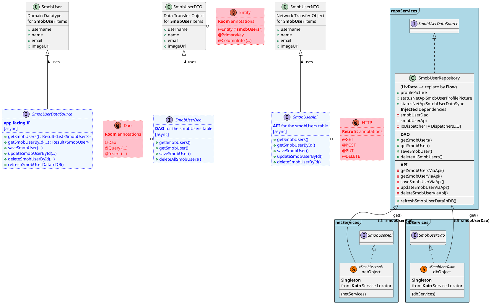

```plantuml
@startuml
interface SmobUserDataSource #aliceblue;line:blue;line.dotted;text:blue {
  **app facing IF**
  [async]
  +getSmobUsers() : Result<List<SmobUser>>
  +getSmobUserById(...) : Result<SmobUser>
  +saveSmobUser(...)
  +updateSmobUserById(...)
  +deleteSmobUserById(...)
  +refreshSmobUserDataInDB()
}

frame "repoServices" #Lightblue {
    class SmobUserRepository implements SmobUserDataSource {
      (**LivData** --> replace by **Flow**)
      +profilePicture
      +statusNetApiSmobUserProfilePicture
      +statusNetApiSmobUserDataSync
      **Injected** Dependencies
      -smobUserDao
      -smobUserApi
      -ioDispatcher [= Dispatchers.IO]
      ---
      **DAO**
      +getSmobUsers()
      +getSmobUser()
      +saveSmobUser()
      +deleteAllSmobUsers()
      ---
      **API**
      -getSmobUsersViaApi()
      -getSmobUserViaApi()
      -saveSmobUserViaApi()
      -updateSmobUserViaApi()
      -deleteSmobUserViaApi()
      ---
      +refreshSmobUserDataInDB()
    }
}

    
class SmobUserNTO {
    Network Transfer Object
    for **SmobUser** items
    ---
    +username
    +name
    +email
    +imageUrl
}

SmobUserApi -up-|> SmobUserNTO : uses >    

annotation HTTP #pink;line:red;line.dotted;text:red {
   **Retrofit** annotations
   {method} @GET
   {method} @POST
   {method} @PUT
   {method} @DELETE
}

SmobUserApi o-right. HTTP

frame "netServices" #Lightblue {
    class netObject << (S,#FF7700) SmobUserApi>> implements SmobUserApi {
        **Singleton**
        from **Koin** Service Locator
        ---
        (netServices)
    }
}

    
class SmobUserDTO {
    Data Transfer Object
    for **SmobUser** items
    ---
    +username
    +name
    +email
    +imageUrl
}
    
SmobUserDao -up-|> SmobUserDTO : uses >

annotation Entity #pink;line:red;line.dotted;text:red {
   **Room** annotations
   {method} @Entity ("**smobUsers**")
   {method} @PrimaryKey
   {method} @ColumnInfo (...)
}

SmobUserDTO o-right. Entity

annotation Dao #pink;line:red;line.dotted;text:red {
   **Room** annotations
   {method} @Dao
   {method} @Query (...)
   {method} @Insert (...)
}

SmobUserDao o-left. Dao

frame "dbServices" #Lightblue {
    class dbObject << (S,#FF7700) SmobUserDao>> implements SmobUserDao {
        **Singleton**
        from **Koin** Service Locator
        ---
        (dbServices)
    }
}

interface SmobUserApi #aliceblue;line:blue;line.dotted;text:blue {
  **API** for the smobUsers table
  [async]
  +getSmobUsers()
  +getSmobUserById()
  +saveSmobUser()
  +updateSmobUserById()
  +deleteSmobUserById()
}

interface SmobUserDao #aliceblue;line:blue;line.dotted;text:blue {
  **DAO** for the smobUsers table
  [async]
  +getSmobUsers()
  +getSmobUser()
  +saveSmobUser()
  +deleteAllSmobUsers()
}

class SmobUser {
Domain Datatype
for **SmobUser** items
---
+username
+name
+email
+imageUrl
}

SmobUserDataSource -up-|> SmobUser : uses >


SmobUserRepository <|-down-- dbObject : "\n     get()\n (DI: **smobUserDao**)" " "
SmobUserRepository <|-down-- netObject :"\nget()\n (DI: **smobUserApi**)     " " "
@enduml
```