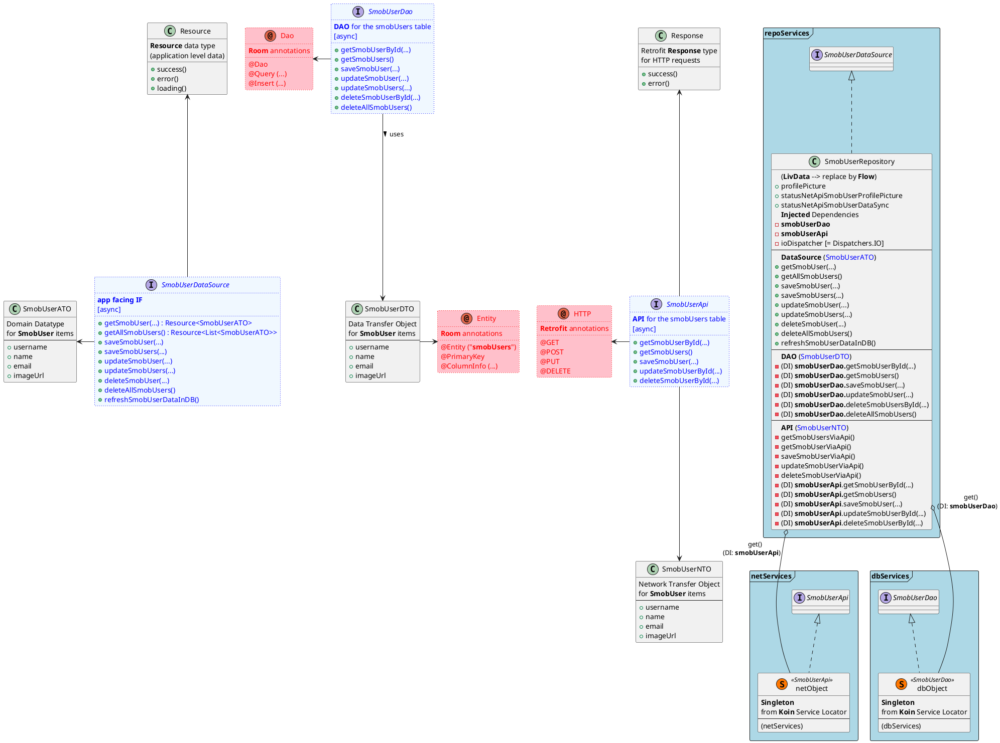

```plantuml
@startuml
interface SmobUserDataSource #aliceblue;line:blue;line.dotted;text:blue {
    **app facing IF**
    [async]
    +getSmobUser(...) : Resource<SmobUserATO>
    +getAllSmobUsers() : Resource<List<SmobUserATO>>
    +saveSmobUser(...)
    +saveSmobUsers(...)
    +updateSmobUser(...)
    +updateSmobUsers(...)
    +deleteSmobUser(...)
    +deleteAllSmobUsers()
    +refreshSmobUserDataInDB()
}

class Resource {
    **Resource** data type
    {field} (application level data)
    +success()
    +error()
    +loading()
}

SmobUserDataSource -up-> Resource

frame "repoServices" #Lightblue {
    class SmobUserRepository implements SmobUserDataSource {
        (**LivData** --> replace by **Flow**)
        +profilePicture
        +statusNetApiSmobUserProfilePicture
        +statusNetApiSmobUserDataSync
        **Injected** Dependencies
        -**smobUserDao**
        -**smobUserApi**
        -ioDispatcher [= Dispatchers.IO]
        ---
        **DataSource** (<color:Blue>SmobUserATO</color>)
        +getSmobUser(...)
        +getAllSmobUsers()
        +saveSmobUser(...)
        +saveSmobUsers(...)
        +updateSmobUser(...)
        +updateSmobUsers(...)
        +deleteSmobUser(...)
        +deleteAllSmobUsers()
        +refreshSmobUserDataInDB()
        ---
        **DAO** (<color:Blue>SmobUserDTO</color>)
        -(DI) **smobUserDao.**getSmobUserById(...)
        -(DI) **smobUserDao.**getSmobUsers()
        -(DI) **smobUserDao.**saveSmobUser(...)
        -(DI) **smobUserDao.**updateSmobUser(...)
        -(DI) **smobUserDao.**deleteSmobUsersById(...)
        -(DI) **smobUserDao.**deleteAllSmobUsers()
        ---
        **API** (<color:Blue>SmobUserNTO</color>)
        -getSmobUsersViaApi()
        -getSmobUserViaApi()
        -saveSmobUserViaApi()
        -updateSmobUserViaApi()
        -deleteSmobUserViaApi()
        -(DI) **smobUserApi**.getSmobUserById(...)
        -(DI) **smobUserApi.**getSmobUsers()
        -(DI) **smobUserApi**.saveSmobUser(...)
        -(DI) **smobUserApi**.updateSmobUserById(...)
        -(DI) **smobUserApi**.deleteSmobUserById(...)
     }
}

    
class SmobUserNTO {
    Network Transfer Object
    for **SmobUser** items
    ---
    +username
    +name
    +email
    +imageUrl
}

SmobUserApi -down-> SmobUserNTO   

annotation HTTP #pink;line:red;line.dotted;text:red {
    **Retrofit** annotations
    {method} @GET
    {method} @POST
    {method} @PUT
    {method} @DELETE
}

SmobUserApi -left-> HTTP

class Response {
    Retrofit **Response** type
    for HTTP requests
    +success()
    +error()
}

SmobUserApi -up-> Response

frame "netServices" #Lightblue {
    class netObject << (S,#FF7700) SmobUserApi>> implements SmobUserApi {
        **Singleton**
        from **Koin** Service Locator
        ---
        (netServices)
    }
}

    
class SmobUserDTO {
    Data Transfer Object
    for **SmobUser** items
    ---
    +username
    +name
    +email
    +imageUrl
}
    
SmobUserDao -down-> SmobUserDTO : uses >

annotation Entity #pink;line:red;line.dotted;text:red {
   **Room** annotations
   {method} @Entity ("**smobUsers**")
   {method} @PrimaryKey
   {method} @ColumnInfo (...)
}

SmobUserDTO -right-> Entity

annotation Dao #pink;line:red;line.dotted;text:red {
   **Room** annotations
   {method} @Dao
   {method} @Query (...)
   {method} @Insert (...)
}

SmobUserDao -left-> Dao

frame "dbServices" #Lightblue {
    class dbObject << (S,#FF7700) SmobUserDao>> implements SmobUserDao {
        **Singleton**
        from **Koin** Service Locator
        ---
        (dbServices)
    }
}

interface SmobUserApi #aliceblue;line:blue;line.dotted;text:blue {
    **API** for the smobUsers table
    [async]
    +getSmobUserById(...)
    +getSmobUsers()
    +saveSmobUser(...)
    +updateSmobUserById(...)
    +deleteSmobUserById(...)
}

interface SmobUserDao #aliceblue;line:blue;line.dotted;text:blue {
    **DAO** for the smobUsers table
    [async]
    +getSmobUserById(...)
    +getSmobUsers()
    +saveSmobUser(...)
    +updateSmobUser(...)
    +updateSmobUsers(...)
    +deleteSmobUserById(...)
    +deleteAllSmobUsers()
}

class SmobUserATO {
Domain Datatype
for **SmobUser** items
---
+username
+name
+email
+imageUrl
}

SmobUserDataSource -left-> SmobUserATO


SmobUserRepository o-down-- dbObject : "\n     get()\n (DI: **smobUserDao**)" " "
SmobUserRepository o-down-- netObject :"\nget()\n (DI: **smobUserApi**)     " " "
@enduml
```