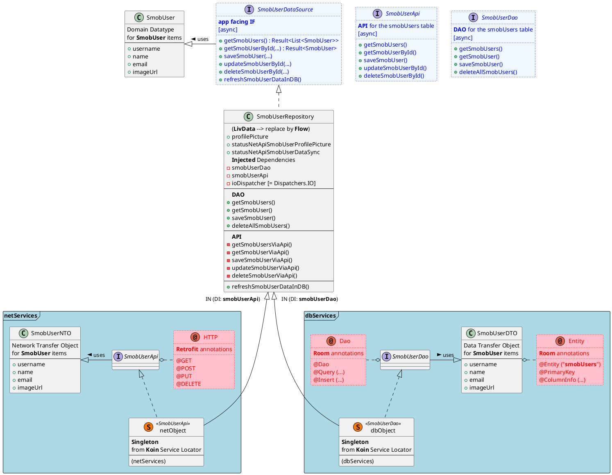

```plantuml
@startuml
class SmobUserRepository implements SmobUserDataSource {
  (**LivData** --> replace by **Flow**)
  +profilePicture
  +statusNetApiSmobUserProfilePicture
  +statusNetApiSmobUserDataSync
  **Injected** Dependencies
  -smobUserDao
  -smobUserApi
  -ioDispatcher [= Dispatchers.IO]
  ---
  **DAO**
  +getSmobUsers()
  +getSmobUser()
  +saveSmobUser()
  +deleteAllSmobUsers()
  ---
  **API**
  -getSmobUsersViaApi()
  -getSmobUserViaApi()
  -saveSmobUserViaApi()
  -updateSmobUserViaApi()
  -deleteSmobUserViaApi()
  ---
  +refreshSmobUserDataInDB()
}

frame "netServices" #Lightblue {
    class netObject << (S,#FF7700) SmobUserApi>> implements SmobUserApi {
        **Singleton**
        from **Koin** Service Locator
        ---
        (netServices)
    }
    
    class SmobUserNTO {
    Network Transfer Object
    for **SmobUser** items
    ---
    +username
    +name
    +email
    +imageUrl
    }
    
    SmobUserApi -left-|> SmobUserNTO : uses >    

    annotation HTTP #pink;line:red;line.dotted;text:red {
       **Retrofit** annotations
       {method} @GET
       {method} @POST
       {method} @PUT
       {method} @DELETE
    }
    
    
    SmobUserApi o-right. HTTP
}

frame "dbServices" #Lightblue {
    class dbObject << (S,#FF7700) SmobUserDao>> implements SmobUserDao {
        **Singleton**
        from **Koin** Service Locator
        ---
        (dbServices)
    }
    
    class SmobUserDTO {
    Data Transfer Object
    for **SmobUser** items
    ---
    +username
    +name
    +email
    +imageUrl
    }
    
    SmobUserDao -right-|> SmobUserDTO : uses >
    
    annotation Entity #pink;line:red;line.dotted;text:red {
       **Room** annotations
       {method} @Entity ("**smobUsers**")
       {method} @PrimaryKey
       {method} @ColumnInfo (...)
    }
    
    SmobUserDTO o-right. Entity

    annotation Dao #pink;line:red;line.dotted;text:red {
       **Room** annotations
       {method} @Dao
       {method} @Query (...)
       {method} @Insert (...)
    }
    
    SmobUserDao o-left. Dao

}

interface SmobUserApi #aliceblue;line:blue;line.dotted;text:blue {
  **API** for the smobUsers table
  [async]
  +getSmobUsers()
  +getSmobUserById()
  +saveSmobUser()
  +updateSmobUserById()
  +deleteSmobUserById()
}

interface SmobUserDao #aliceblue;line:blue;line.dotted;text:blue {
  **DAO** for the smobUsers table
  [async]
  +getSmobUsers()
  +getSmobUser()
  +saveSmobUser()
  +deleteAllSmobUsers()
}

interface SmobUserDataSource #aliceblue;line:blue;line.dotted;text:blue {
  **app facing IF**
  [async]
  +getSmobUsers() : Result<List<SmobUser>>
  +getSmobUserById(...) : Result<SmobUser>
  +saveSmobUser(...)
  +updateSmobUserById(...)
  +deleteSmobUserById(...)
  +refreshSmobUserDataInDB()
}

class SmobUser {
Domain Datatype
for **SmobUser** items
---
+username
+name
+email
+imageUrl
}

SmobUserDataSource -left-|> SmobUser : uses >


SmobUserRepository <|-down-- dbObject : "     IN (DI: **smobUserDao**)" " "
SmobUserRepository <|-down-- netObject :"IN (DI: **smobUserApi**)     " " "
@enduml
```