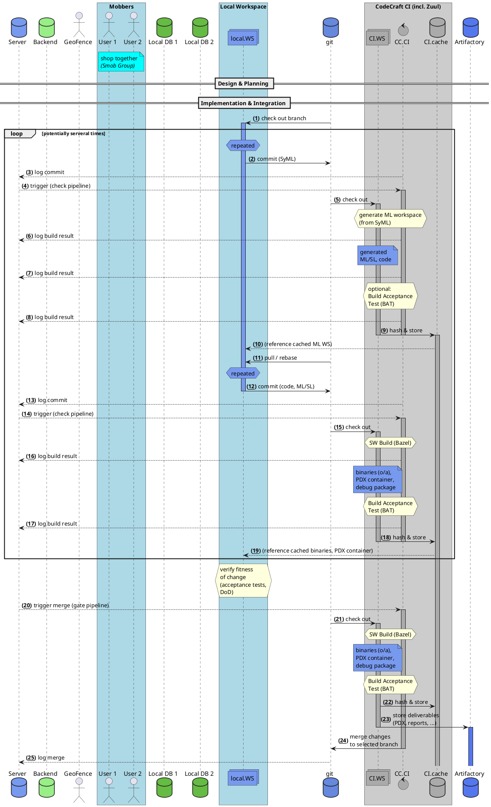

```plantuml
@startuml
!$be = "99EE88"
!$spec = "99DD88"
!$cmsy = "66BB44"

!$server = "7799EE"
!$git = "6688DD"
!$ci = "CCCCCC"
!$ciws = "AAAAAA"
!$arti = "5577EE"


database Server order 10 #$server
database Backend order 12 #$be

actor GeoFence order 14

box "Mobbers" #LightBlue
actor "User 1" order 15
actor "User 2" order 16
end box

note over "User 1", "User 2" #aqua
shop together
//(Smob Group)//
end note

database "Local DB 1" order 18 #$cmsy
database "Local DB 2" order 19 #$cmsy

box "Local Workspace" #LightBlue
collections local.WS order 22 #$server
end box

database git order 30 #$git
box "CodeCraft CI (incl. Zuul)" #$ci
collections CI.WS order 32 #$ciws
control CC.CI order 34 #$ciws
database CI.cache order 36 #$ciws
end box

database Artifactory order 50 #$arti

autonumber "<b>(<u>##</u>)"

== Design & Planning ==

== Implementation & Integration ==

git->local.WS ++ #$server : check out branch

loop potentially serveral times

	hnote over local.WS #$server : repeated
	local.WS->git : commit (SyML)
	CC.CI-->Server : log commit

	Server-->CC.CI ++ #$ciws : trigger (check pipeline)
	git->CI.WS ++ #$ciws : check out
	hnote over CC.CI, CI.WS : generate ML workspace\n(from SyML)
	CC.CI-->Server : log build result
	note over CI.WS #$server : generated\nML/SL, code
	CC.CI-->Server : log build result
	hnote over CC.CI, CI.WS : optional:\nBuild Acceptance\nTest (BAT)
	CC.CI-->Server : log build result
	CI.WS->CI.cache -- : hash & store
	activate CI.cache #$ciws
	deactivate CC.CI
	CI.cache-->local.WS : (reference cached ML WS)

	git->local.WS : pull / rebase
	hnote over local.WS #$server : repeated
	local.WS->git -- : commit (code, ML/SL)
	CC.CI-->Server : log commit
	Server-->CC.CI ++ #$ciws : trigger (check pipeline)
	git->CI.WS ++ #$ciws : check out
	hnote over CC.CI, CI.WS : SW Build (Bazel)
	CC.CI-->Server : log build result
	note over CI.WS #$server : binaries (o/a),\nPDX container,\ndebug package
	hnote over CC.CI, CI.WS : Build Acceptance\nTest (BAT)
	CC.CI-->Server : log build result
	CI.WS->CI.cache -- : hash & store
	deactivate CC.CI
	CI.cache-->local.WS : (reference cached binaries, PDX container)

end

hnote over local.WS : verify fitness\nof change\n(acceptance tests,\nDoD)
Server-->CC.CI ++ #$ciws : trigger merge (gate pipeline)
git->CI.WS ++ #$ciws : check out
hnote over CC.CI, CI.WS : SW Build (Bazel)
note over CI.WS #$server : binaries (o/a),\nPDX container,\ndebug package
hnote over CC.CI, CI.WS : Build Acceptance\nTest (BAT)
CI.WS->CI.cache : hash & store
CI.WS->Artifactory -- : store deliverables\n(PDX, reports, ...)
activate Artifactory #$arti
CC.CI->git -- : merge changes\nto selected branch
git-->Server : log merge
deactivate Server

deactivate git
@enduml
```