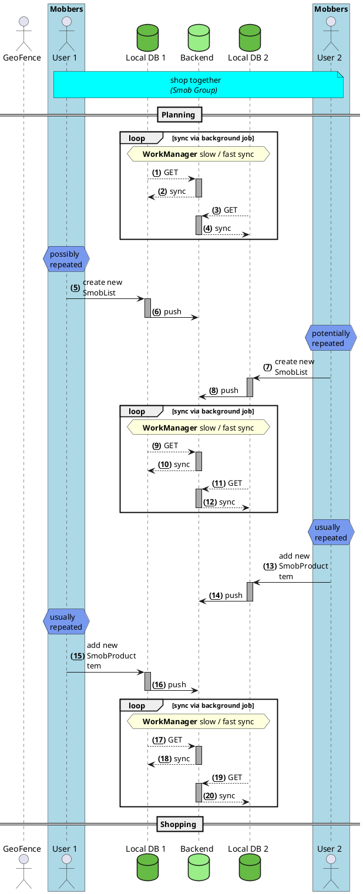

```plantuml
@startuml
!$be = "99EE88"
!$spec = "99DD88"
!$cmsy = "66BB44"

!$server = "7799EE"
!$git = "6688DD"
!$ci = "CCCCCC"
!$ciws = "AAAAAA"
!$arti = "5577EE"


database Backend order 15 #$be

actor GeoFence order 13

box "Mobbers" #LightBlue
actor "User 1" order 14
actor "User 2" order 19
end box

note over "User 1", "User 2" #aqua
shop together
//(Smob Group)//
end note

database "Local DB 1" order 14 #$cmsy
database "Local DB 2" order 16 #$cmsy


autonumber "<b>(<u>##</u>)"

== Planning ==

loop sync via background job

    hnote over "Local DB 1", "Local DB 2" : **WorkManager** slow / fast sync
	"Local DB 1" --> Backend ++ #$ciws : GET
	Backend --> "Local DB 1" -- : sync 
	"Local DB 2" --> Backend ++ #$ciws : GET
	Backend --> "Local DB 2" -- : sync 

end

hnote over "User 1" #$server : possibly\nrepeated
"User 1" -> "Local DB 1" ++ #$ciws : create new\nSmobList
"Local DB 1" -> "Backend" -- : push

hnote over "User 2" #$server : potentially\nrepeated
"User 2" -> "Local DB 2" ++ #$ciws : create new\nSmobList
"Local DB 2" -> "Backend" -- : push

loop sync via background job

    hnote over "Local DB 1", "Local DB 2" : **WorkManager** slow / fast sync
	"Local DB 1" --> Backend ++ #$ciws : GET
	Backend --> "Local DB 1" -- : sync 
	"Local DB 2" --> Backend ++ #$ciws : GET
	Backend --> "Local DB 2" -- : sync 

end

hnote over "User 2" #$server : usually\nrepeated
"User 2" -> "Local DB 2" ++ #$ciws : add new\nSmobProduct\ntem
"Local DB 2" -> "Backend" -- : push

hnote over "User 1" #$server : usually\nrepeated
"User 1" -> "Local DB 1" ++ #$ciws : add new\nSmobProduct\ntem
"Local DB 1" -> "Backend" -- : push

loop sync via background job

    hnote over "Local DB 1", "Local DB 2" : **WorkManager** slow / fast sync
	"Local DB 1" --> Backend ++ #$ciws : GET
	Backend --> "Local DB 1" -- : sync 
	"Local DB 2" --> Backend ++ #$ciws : GET
	Backend --> "Local DB 2" -- : sync 

end

== Shopping ==

@enduml
```